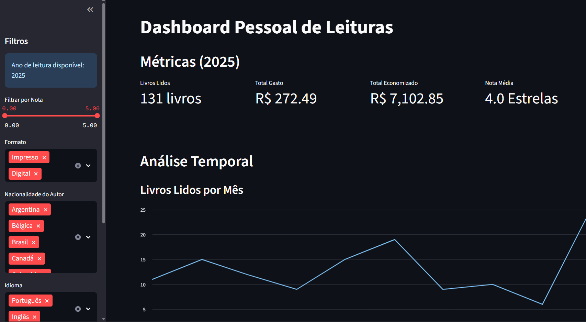

Dashboard Pessoal de Hábitos de Leitura
Este é um dashboard web interativo construído para rastrear, analisar e visualizar meus hábitos de leitura pessoais. A aplicação foi desenvolvida com Python e Streamlit, e busca dados ao vivo de uma planilha pessoal do Google Sheets, garantindo que o dashboard esteja sempre atualizado.

Principais Funcionalidades
Conexão com Dados ao Vivo: Carrega e processa automaticamente os dados de leitura de uma planilha pública do Google Sheets, demonstrando a habilidade de trabalhar com fontes de dados online e em tempo real.

Limpeza de Dados Robusta: O script de backend realiza uma limpeza de dados e engenharia de features abrangentes, lidando com formatos inconsistentes de datas, valores monetários (R$) e notas de avaliação.

Filtros Interativos: Uma barra lateral completa permite aos usuários filtrar os dados por intervalo de anos, nota do livro, formato, nacionalidade do autor, idioma e método de aquisição.

KPIs e Métricas Relevantes: Métricas de destaque fornecem um resumo rápido do total de livros lidos, total de dinheiro gasto, economia total (comparando o valor de capa do livro vs. o custo) e a nota média das leituras.

Visualizações Avançadas: O dashboard inclui uma variedade de gráficos construídos com Altair e Streamlit para explorar diferentes facetas dos meus hábitos de leitura, incluindo:

Uma análise de série temporal de livros lidos por mês.

Análise da diversidade de autores (gênero e etnia).

Análise financeira de gastos vs. economia por fonte de aquisição.

Distribuições de formatos de leitura e notas.

Screenshot

Tecnologias Utilizadas (Tech Stack)
Linguagem: Python

Dashboard: Streamlit

Manipulação de Dados: Pandas

Visualização de Dados: Altair, gráficos nativos do Streamlit

Demonstração ao Vivo:
https://leitura.streamlit.app/

